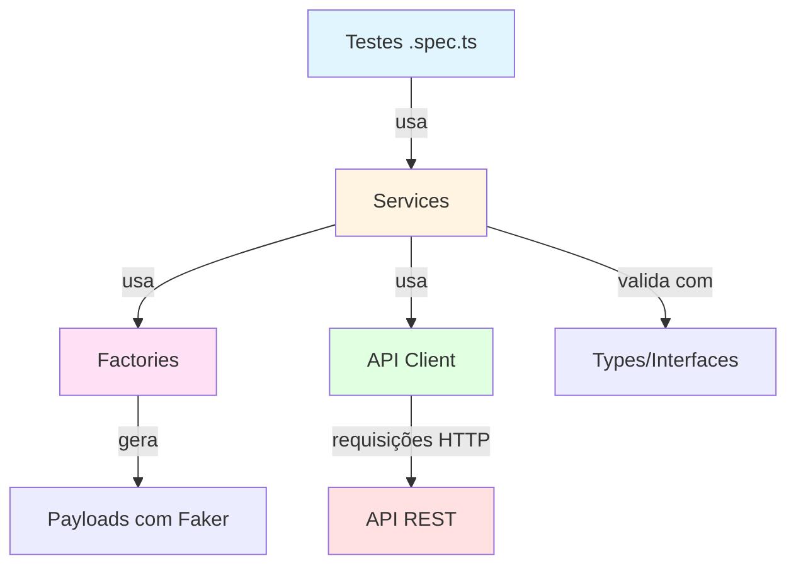

# 🚀 Automação de APIs com Playwright + TypeScript

[](https://playwright.dev/)
[](https://www.typescriptlang.org/)
[](https://nodejs.org/)
[](LICENSE)

Projeto de automação de testes de API utilizando **Playwright Test** e **TypeScript**, com arquitetura modular baseada em **Services**, **Factories** e **Types** para máxima reutilização e manutenibilidade.

---

## 📋 Índice

- [Sobre o Projeto](#-sobre-o-projeto)
- [Tecnologias Utilizadas](#-tecnologias-utilizadas)
- [Arquitetura](#-arquitetura)
- [Pré-requisitos](#-pré-requisitos)
- [Instalação](#-instalação)
- [Execução dos Testes](#-execução-dos-testes)
- [Estrutura do Projeto](#-estrutura-do-projeto)
- [Padrões e Boas Práticas](#-padrões-e-boas-práticas)
- [Contribuindo](#-contribuindo)

---

## 📖 Sobre o Projeto

Este projeto implementa testes automatizados para APIs REST, cobrindo operações CRUD completas para **Usuários** e **Produtos**. A arquitetura foi desenhada para facilitar:

- ✅ Criação rápida de novos cenários de teste
- ✅ Reutilização de código através de services e factories
- ✅ Manutenção simplificada com tipagem forte (TypeScript)
- ✅ Geração automática de dados de teste com Faker
- ✅ Relatórios detalhados e traces de execução

---

## 🛠 Tecnologias Utilizadas

| Tecnologia | Versão | Descrição |
|------------|--------|-----------|
| [Playwright Test](https://playwright.dev/) | 1.42.0 | Framework de testes para APIs e E2E |
| [TypeScript](https://www.typescriptlang.org/) | 5.0 | Superset JavaScript com tipagem estática |
| [Faker.js](https://fakerjs.dev/) | 8.0 | Geração de dados de teste realistas |
| [ESLint](https://eslint.org/) | 8.0 | Linter para qualidade de código |

---

## 🏗 Arquitetura

O projeto segue uma arquitetura em camadas para separar responsabilidades:

```
src/
├── api/              # Cliente HTTP (GET, POST, PUT, DELETE)
├── factories/        # Geradores de payloads com Faker
├── services/         # Lógica de negócio dos endpoints
├── types/            # Interfaces TypeScript
├── helpers/          # Utilitários gerais
└── tests/            # Suites de teste organizadas por recurso
```



### Camadas

- **API Client**: Centraliza chamadas HTTP com tratamento de headers e autenticação
- **Factories**: Gera payloads válidos com dados aleatórios (Faker)
- **Services**: Encapsula lógica de cada endpoint (CRUD completo)
- **Types**: Define contratos de dados com TypeScript
- **Tests**: Cenários de teste positivos e negativos

---

## ✅ Pré-requisitos

Antes de começar, certifique-se de ter instalado:

- **Node.js** >= 18.x ([Download](https://nodejs.org/))
- **npm** >= 9.x (vem com Node.js)
- **Git** ([Download](https://git-scm.com/))

---

## 📦 Instalação

1. **Clone o repositório**

```bash
git clone https://github.com/seu-usuario/automacao-playwright-api.git
cd automacao-playwright-api
```

2. **Instale as dependências**

```bash
npm install
```

3. **Instale os binários do Playwright** (opcional, mas recomendado)

```bash
npx playwright install
```

---

## ▶️ Execução dos Testes

### Comandos Disponíveis

```bash
# Executar todos os testes (headless)
npm test

# Executar testes específicos por tag
npx playwright test --grep @produtos

# Executar apenas testes positivos
npx playwright test --grep @positivo

# Executar apenas testes negativos
npx playwright test --grep @negativo

# Executar suite específica
npx playwright test src/tests/usuarios/postUsuarios.spec.ts

### Visualizar Relatórios

Após a execução, o Playwright gera automaticamente:

- **HTML Report**: `playwright-report/index.html`
- **Traces**: Disponíveis para cada teste com falha

```bash
npx playwright show-report
```

---

## 📂 Estrutura do Projeto

```
automacao-playwright-api/
│
├── src/
│   ├── api/
│   │   └── client.ts              # Cliente HTTP reutilizável
│   │
│   ├── factories/
│   │   ├── productFactory.ts      # Gerador de payloads de produto
│   │   └── userFactory.ts         # Gerador de payloads de usuário
│   │
│   ├── services/
│   │   ├── autenticacaoService.ts # Autenticação e login
│   │   ├── produtoService.ts      # CRUD de produtos
│   │   └── usuarioService.ts      # CRUD de usuários
│   │
│   ├── types/
│   │   ├── produto.ts             # Interface ProdutoPayload
│   │   └── usuario.ts             # Interface UsuarioPayload
│   │
│   ├── helpers/
│   │   └── generators.ts          # Geradores auxiliares (CPF, email, etc.)
│   │
│   └── tests/
│       ├── login/
│       │   └── postLogin.spec.ts
│       ├── produtos/
│       │   ├── getProdutos.spec.ts
│       │   ├── postProdutos.spec.ts
│       │   └── putProdutos.spec.ts
│       └── usuarios/
│           ├── deleteUsuarios.spec.ts
│           ├── getUsuarios.spec.ts
│           ├── postUsuarios.spec.ts
│           └── putUsuarios.spec.ts
│
├── playwright.config.ts           # Configuração do Playwright
├── tsconfig.json                  # Configuração do TypeScript
├── package.json                   # Dependências e scripts
└── README.md                      # Este arquivo
```

---

## 🎯 Padrões e Boas Práticas

### 1. **Nomenclatura de Testes**

Cada teste segue o padrão:

```typescript
test("Descrição clara do comportamento esperado", {
  tag: ["@001", "@recurso", "@metodo", "@tipo"],
}, async ({ request }) => {
  // Arrange, Act, Assert
});
```

### 2. **Tags Organizacionais**

- `@001, @002...`: Identificador único do teste
- `@usuarios, @produtos, @login`: Recurso testado
- `@get, @post, @put, @delete`: Método HTTP
- `@positivo, @negativo`: Tipo de cenário

### 3. **Reutilização com Services**

Evite duplicação criando services:

```typescript
// ❌ Evite
const response = await request.post('/usuarios', { data: {...} });

// ✅ Prefira
const { response } = await criarUsuario(request, { administrador: 'true' });
```

### 4. **Geração de Dados com Factories**

Use factories para dados dinâmicos:

```typescript
// ❌ Evite dados hardcoded
const payload = { nome: 'João Silva', email: 'joao@test.com' };

// ✅ Use factories
const payload = generateUserPayload({ administrador: 'true' });
```

### 5. **Tipagem Forte**

Sempre defina interfaces para payloads:

```typescript
export interface UsuarioPayload {
  nome: string;
  email: string;
  password: string;
  administrador: string;
}
```

### 6. **Validações Completas**

Valide não apenas status, mas também estrutura da resposta:

```typescript
expect(response.status()).toBe(201);
const body = await response.json();
expect(body.message).toBe("Cadastro realizado com sucesso");
expect(body._id).toBeTruthy();
```

---

## 🤝 Contribuindo

Contribuições são bem-vindas! Para contribuir:

1. Faça um **fork** do projeto
2. Crie uma **branch** para sua feature (`git checkout -b feature/nova-feature`)
3. **Commit** suas mudanças (`git commit -m 'Adiciona nova feature'`)
4. **Push** para a branch (`git push origin feature/nova-feature`)
5. Abra um **Pull Request**

### Padrões de Commit

Utilize [Conventional Commits](https://www.conventionalcommits.org/):

```
feat: adiciona suite de testes para DELETE /produtos
fix: corrige validação de email no userFactory
docs: atualiza README com exemplos de execução
test: adiciona cenário de produto com estoque zero
```

---

## 📄 Licença

Este projeto está sob a licença MIT. Consulte o arquivo `LICENSE` para mais detalhes.

---

## 👤 Autor

Desenvolvido por **[Rodrigo Trombeta]**

[](https://www.linkedin.com/in/seu-perfil)
[](https://github.com/seu-usuario)

---

## 📞 Suporte

Encontrou algum problema ou tem sugestões? Abra uma [issue](https://github.com/seu-usuario/automacao-playwright-api/issues) no GitHub!

---

⭐ Se este projeto foi útil para você, considere deixar uma estrela no repositório!
