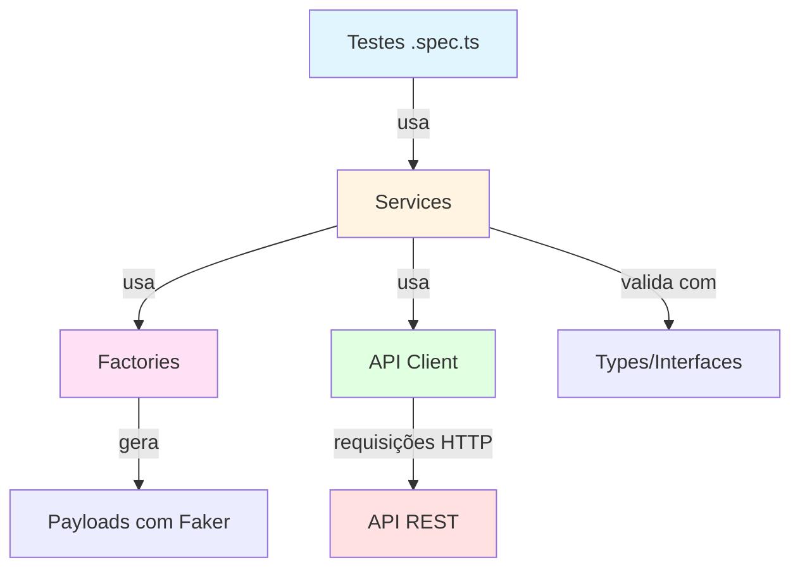

# 🚀 Automação de APIs com Playwright + TypeScript

[](https://playwright.dev/)
[](https://www.typescriptlang.org/)
[](https://nodejs.org/)
[](LICENSE)
[](https://rftrombeta.github.io/automacao-playwright-api/reports/latest/index.html)
[](https://rftrombeta.github.io/automacao-playwright-api/reports/)
<!-- [](https://github.com/seu-usuario/automacao-playwright-api/actions) -->

Projeto de automação de testes de API utilizando **Playwright Test** e **TypeScript**, com arquitetura modular baseada em **Services**, **Factories** e **Types** para máxima reutilização e manutenibilidade.

> **🔄 CI/CD Configurado**: Testes executam automaticamente a cada commit. Veja [TESTING.md - CI/CD](TESTING.md#-cicd---execução-automática) para detalhes.

---

## 📋 Índice

- [Sobre o Projeto](#-sobre-o-projeto)
- [Tecnologias Utilizadas](#-tecnologias-utilizadas)
- [Arquitetura](#-arquitetura)
- [Pré-requisitos](#-pré-requisitos)
- [Instalação](#-instalação)
- [Execução dos Testes](#-execução-dos-testes)
- [Documentação dos Testes](#-documentação-dos-testes)
- [CI/CD](#-cicd---integração-contínua)
- [Estrutura do Projeto](#-estrutura-do-projeto)
- [Padrões Adotados](#-padrões-adotados)
- [Contribuindo](#-contribuindo)

---

## 📖 Sobre o Projeto

Este projeto implementa testes automatizados para APIs REST, cobrindo operações CRUD completas para **Usuários** e **Produtos**. A arquitetura foi desenhada para facilitar:

- ✅ Criação rápida de novos cenários de teste
- ✅ Reutilização de código através de services e factories
- ✅ Manutenção simplificada com tipagem forte (TypeScript)
- ✅ Geração automática de dados de teste com Faker
- ✅ Relatórios detalhados e traces de execução

> **📚 Documentação Completa de Testes**  
> Para estratégia, cobertura detalhada e guia de contribuição, consulte **[TESTING.md](TESTING.md)**

---

## 🛠 Tecnologias Utilizadas

| Tecnologia | Versão | Descrição |
|------------|--------|-----------|
| [Playwright Test](https://playwright.dev/) | 1.42.0 | Framework de testes para APIs e E2E |
| [TypeScript](https://www.typescriptlang.org/) | 5.0 | Superset JavaScript com tipagem estática |
| [Faker.js](https://fakerjs.dev/) | 8.0 | Geração de dados de teste realistas |
| [ESLint](https://eslint.org/) | 8.0 | Linter para qualidade de código |

---

## 🏗 Arquitetura

O projeto segue uma arquitetura em camadas para separar responsabilidades:

```
src/
├── api/              # Cliente HTTP (GET, POST, PUT, DELETE)
├── factories/        # Geradores de payloads com Faker
├── services/         # Lógica de negócio dos endpoints
├── types/            # Interfaces TypeScript
├── helpers/          # Utilitários gerais
└── tests/            # Suites de teste organizadas por recurso
```



### Camadas

- **API Client**: Centraliza chamadas HTTP com tratamento de headers e autenticação
- **Factories**: Gera payloads válidos com dados aleatórios (Faker)
- **Services**: Encapsula lógica de cada endpoint (CRUD completo)
- **Types**: Define contratos de dados com TypeScript
- **Tests**: Cenários de teste positivos e negativos

---

## ✅ Pré-requisitos

Antes de começar, certifique-se de ter instalado:

- **Node.js** >= 18.x ([Download](https://nodejs.org/))
- **npm** >= 9.x (vem com Node.js)
- **Git** ([Download](https://git-scm.com/))

---

## 📦 Instalação

1. **Clone o repositório**

```bash
git clone https://github.com/seu-usuario/automacao-playwright-api.git
cd automacao-playwright-api
```

2. **Instale as dependências**

```bash
npm install
```

3. **Instale os binários do Playwright** (opcional, mas recomendado)

```bash
npx playwright install
```

---

## ▶️ Execução dos Testes

### Comandos Básicos

```bash
# Executar todos os testes
npm test

# Visualizar relatório HTML
npx playwright show-report
```

> **💡 Mais comandos disponíveis**  
> Para executar por tags, filtros específicos, modo debug e outras opções, consulte **[TESTING.md - Como Executar](TESTING.md#️-como-executar)**

---

## � Documentação dos Testes

Para informações detalhadas sobre a estratégia de testes, cobertura completa, padrões e como adicionar novos cenários, consulte:

### **[📖 TESTING.md - Guia Completo de Testes](TESTING.md)**

O guia inclui:

- ✅ **Estratégia e níveis de teste** (positivo, negativo, segurança)
- ✅ **Cobertura resumida** (Login, Usuários, Produtos)
- ✅ **Comandos completos de execução** (filtros por tag, método, recurso)
- ✅ **Padrões e convenções** (tags, nomenclatura, estrutura AAA)
- ✅ **Como adicionar novos testes** (template step-by-step)
- ✅ **Boas práticas e anti-patterns** (DO's e DON'Ts)

---

## 🔄 CI/CD - Integração Contínua

O projeto possui **GitHub Actions** configurado para executar testes automaticamente.

### Quando os Testes Executam

- ✅ A cada **push** nas branches `main`, `master` ou `develop`
- ✅ Em **Pull Requests** para essas branches
- ✅ **Manualmente** via botão "Run workflow" no GitHub

### Como Acessar os Resultados

#### Opção 1: Visualizar Online (Recomendado) 🌐

O relatório é publicado automaticamente no **GitHub Pages** após cada push nas branches `main` ou `master`:

**Relatorio mais recente**: `https://rftrombeta.github.io/automacao-playwright-api/reports/latest/index.html`

**Historico de execucoes**: `https://rftrombeta.github.io/automacao-playwright-api/reports/`

> **⚙️ Ativação Automática**: 
> O GitHub Pages será configurado automaticamente no primeiro push. Se após o push você ver erro de permissões:
> 1. Acesse **Settings** → **Actions** → **General**
> 2. Em "Workflow permissions", escolha **Read and write permissions**
> 3. Marque **Allow GitHub Actions to create and approve pull requests**
> 4. Salve e faça novo push

#### Opção 2: Download do Artefato

1. Acesse a aba **Actions** no repositório do GitHub
2. Clique no workflow "Testes de API"
3. Role até a seção **Artifacts** ao final da página
4. Baixe o artefato `playwright-report`
5. Descompacte e abra o arquivo `index.html` no navegador

### Badge de Status (Opcional)

Adicione ao topo do README após o primeiro workflow executar:

```markdown

```

> **📁 Retenção**: Relatórios web ficam no último estado do push. Artefatos por **30 dias**.

---

## 📂 Estrutura do Projeto

```
automacao-playwright-api/
│
├── src/
│   ├── api/
│   │   └── client.ts              # Cliente HTTP reutilizável
│   │
│   ├── factories/
│   │   ├── productFactory.ts      # Gerador de payloads de produto
│   │   └── userFactory.ts         # Gerador de payloads de usuário
│   │
│   ├── services/
│   │   ├── autenticacaoService.ts # Autenticação e login
│   │   ├── produtoService.ts      # CRUD de produtos
│   │   └── usuarioService.ts      # CRUD de usuários
│   │
│   ├── types/
│   │   ├── produto.ts             # Interface ProdutoPayload
│   │   └── usuario.ts             # Interface UsuarioPayload
│   │
│   ├── helpers/
│   │   └── generators.ts          # Geradores auxiliares (CPF, email, etc.)
│   │
│   └── tests/
│       ├── login/
│       │   └── postLogin.spec.ts
│       ├── produtos/
│       │   ├── getProdutos.spec.ts
│       │   ├── postProdutos.spec.ts
│       │   └── putProdutos.spec.ts
│       └── usuarios/
│           ├── deleteUsuarios.spec.ts
│           ├── getUsuarios.spec.ts
│           ├── postUsuarios.spec.ts
│           └── putUsuarios.spec.ts
│
├── playwright.config.ts           # Configuração do Playwright
├── tsconfig.json                  # Configuração do TypeScript
├── package.json                   # Dependências e scripts
└── README.md                      # Este arquivo
```

---

## 🎯 Padrões Adotados

O projeto segue convenções consistentes para facilitar manutenção e colaboração:

- **Services**: Encapsulam lógica de endpoints (evita duplicação)
- **Factories**: Geram dados dinâmicos com Faker (sem hardcode)
- **Tags**: Sistema multi-tag para filtros flexíveis (`@recurso`, `@metodo`, `@tipo`)
- **Nomenclatura**: Testes em português, descritivos e auto-explicativos
- **Estrutura AAA**: Arrange, Act, Assert em todos os testes
- **Tipagem forte**: Interfaces TypeScript para todos os payloads

> **📖 Detalhes Completos**  
> Para exemplos de código, anti-patterns e guia completo, consulte **[TESTING.md - Padrões e Boas Práticas](TESTING.md#-padrões-e-convenções)**

---

## 🤝 Contribuindo

Contribuições são bem-vindas! Para contribuir:

1. Faça um **fork** do projeto
2. Crie uma **branch** para sua feature (`git checkout -b feature/nova-feature`)
3. **Commit** suas mudanças (`git commit -m 'Adiciona nova feature'`)
4. **Push** para a branch (`git push origin feature/nova-feature`)
5. Abra um **Pull Request**

> **🔄 Testes Automáticos**: Ao abrir um PR, os testes executam automaticamente via GitHub Actions. Certifique-se de que todos passem antes do merge.

### Padrões de Commit

Utilize [Conventional Commits](https://www.conventionalcommits.org/):

```
feat: adiciona suite de testes para DELETE /produtos
fix: corrige validação de email no userFactory
docs: atualiza README com exemplos de execução
test: adiciona cenário de produto com estoque zero
ci: atualiza workflow do GitHub Actions
```

---

## 📄 Licença

Este projeto está sob a licença MIT. Consulte o arquivo `LICENSE` para mais detalhes.

---

## 👤 Autor

Desenvolvido por **[Rodrigo Trombeta]**

[](https://www.linkedin.com/in/rodrigo-trombeta-21b89252/)
[](https://github.com/rftrombeta)

---

## 📞 Suporte

Encontrou algum problema ou tem sugestões? Abra uma [issue](https://github.com/rftrombeta/automacao-playwright-api/issues) no GitHub!

---

⭐ Se este projeto foi útil para você, considere deixar uma estrela no repositório!
